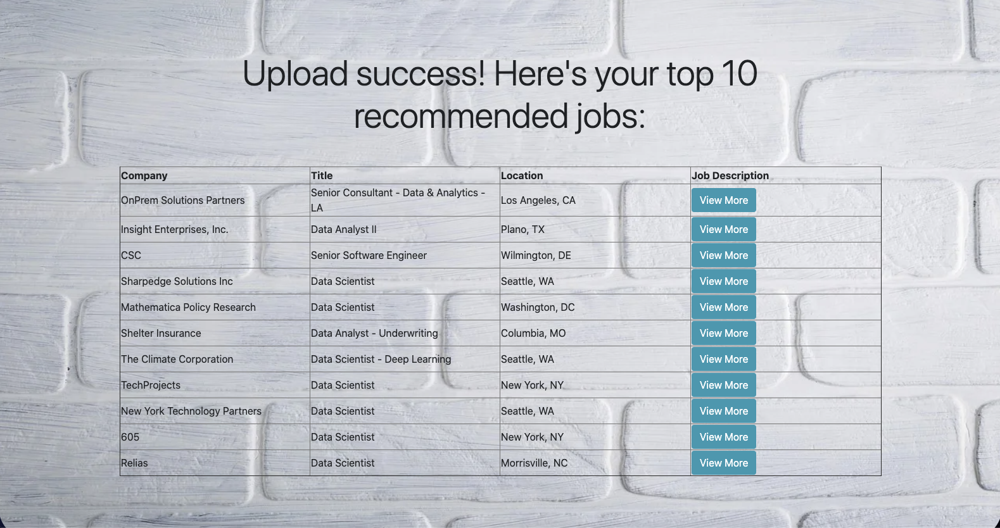
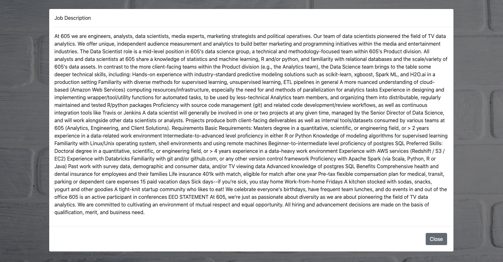

# Job Recommendation App 
This application provides job recommendations based on a given resume uploaded by the user. The job recommender was built using flask and HTML, and data analysis was done using nltk, regex, pandas, and numpy. 

# Overview 
- Web Scraping: use glassdoor_scraper.ipynb to scrape job posting data from Glassdoor
- Data Cleaning: two separate scripts are used to preprocess job and resume data, respectively 
- Recommendation: cosine_similarity.py computes cosine similarity scores, which are used by recommender.py to provide job recommendations
- Front End: the HTML files are used for the front end, which includes additional functionalities such as viewing the job description details 

# Running the App
To test the code, run the following command in your terminal in the job_recommender directory:
<pre>
 python3 app.py
</pre>

# Requirements
1. <a href="https://www.python.org/"> Python</a> (3.7.7)
2. <a href="http://jupyter.org/">Jupyter Notebook</a>
3. <a href="https://flask.palletsprojects.com/en/1.1.x/">Flask</a>
4. <a href="http://www.numpy.org/">NumPy</a>
5. <a href="http://pandas.pydata.org">Pandas</a>
6. <a href="https://www.nltk.org/">NLTK</a> 
7. <a href="https://pypi.org/project/regex/">Regex</a> 
8. <a href="https://texthero.org/">Texthero</a> 
9. <a href="https://pypi.org/project/Unidecode/">Unidecode</a> 
10. <a href="https://pypi.org/project/fitz/">fitz</a> 
11. <a href="https://pypi.org/project/Werkzeug/">Werkzeug</a>

To install all of them (except Python) using pip: 
<pre>
 pip install -r requirements.txt
</pre>

